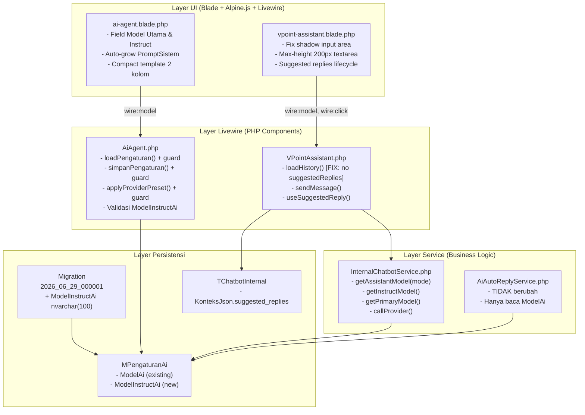
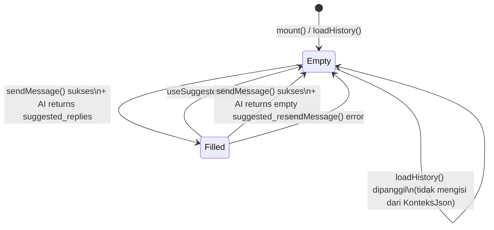

# Design Document — AI Model Instruct & UI Improvements

## Overview

Lihat bagian **Ikhtisar** di bawah untuk penjelasan lengkap dalam Bahasa Indonesia.

## Architecture

Lihat bagian **Arsitektur** di bawah untuk diagram dan penjelasan lengkap.

## Components and Interfaces

Lihat bagian **Komponen dan Antarmuka** di bawah.

## Data Models

Lihat bagian **Model Data** di bawah.

## Correctness Properties

Lihat bagian **Properti Kebenaran** di bawah untuk penjelasan lengkap dalam Bahasa Indonesia.

### Property 1: getAssistantModel selalu mengembalikan string non-kosong

*For any* kombinasi nilai `ModelInstructAi` (null, empty string, atau string valid), `ModelAi` (null, empty string, atau string valid), dan `mode` ∈ `{'light', 'fast'}`, `getAssistantModel(settings, mode)` selalu mengembalikan string non-kosong.

**Validates: Requirements 12.5, 2.1, 2.2, 2.3, 2.4**

### Property 2: Mode menentukan sumber model secara konsisten

*For any* settings object dengan `ModelInstructAi` non-kosong yang berbeda dari `ModelAi`: `getAssistantModel(settings, 'light')` = `ModelInstructAi` dan `getAssistantModel(settings, 'fast')` = `ModelAi`. Untuk `ModelInstructAi` kosong/null, kedua mode mengembalikan nilai yang sama.

**Validates: Requirements 2.1, 2.2, 2.3, 12.1, 12.2**

### Property 3: Idempotency migrasi tidak menghasilkan error

*For any* state database awal (kolom sudah ada atau belum), menjalankan migrasi `up()` tidak pernah menghasilkan SQL exception.

**Validates: Requirements 1.2, 1.3**

### Property 4: loadHistory tidak mengisi suggestedReplies

*For any* riwayat percakapan yang tersimpan di database (termasuk pesan dengan `suggested_replies` non-kosong di `KonteksJson`), setelah `loadHistory()` selesai, `$suggestedReplies` selalu bernilai `[]`.

**Validates: Requirements 6.1, 6.2**

### Property 5: useSuggestedReply selalu mereset suggestedReplies ke array kosong

*For any* string `$reply`, setelah `useSuggestedReply($reply)` dipanggil, `$suggestedReplies` selalu bernilai `[]`.

**Validates: Requirements 6.4, 6.5**

### Property 6: Simetri translation keys antar dua bahasa

*For any* key yang ada di `resources/lang/id/ui.php` bagian `pages.ai_agent`, key yang identik harus ada di `resources/lang/en/ui.php` — dan sebaliknya. Symmetric difference antara dua set key tersebut harus kosong.

**Validates: Requirements 5.1, 5.2, 5.3, 5.4, 5.5**

## Error Handling

Lihat bagian **Penanganan Error** di bawah.

## Testing Strategy

Lihat bagian **Strategi Pengujian** di bawah.

---

## Ikhtisar

Feature ini mencakup tiga kelompok perubahan yang saling terkait pada aplikasi VPoint Care (Laravel 11 + Filament 3 + Livewire 3):

**Kelompok A — Model Instruct AI:** Menambahkan kolom `ModelInstructAi` ke tabel `MPengaturanAi` melalui migrasi kondisional SQL Server, lalu memperbarui logika pemilihan model di `InternalChatbotService` agar VPoint Assistant (mode Ringan) menggunakan model khusus instruct — dengan fallback ke Model Utama jika kosong.

**Kelompok B — Bug Fix UI VPoint Assistant:** (1) Hapus `shadow-sm` dari tombol submit area input bawah; (2) Batasi max-height textarea pesan ke 200px (ganti `max-h-[60vh]` dan kalkulasi Alpine.js); (3) Perbaiki `loadHistory()` agar tidak mengisi `$suggestedReplies` dari data historis.

**Kelompok C — Perbaikan UI AI Agent:** (1) Ubah textarea `PromptSistem` ke mode auto-grow (min 120px, tanpa `resize-y`) menggunakan Alpine.js; (2) Kompres layout template dari `min-h-60` ke `min-h-[80px]` agar dua kolom di desktop terlihat proporsional.

---

## Status Implementasi yang Sudah Ada

Sebelum merancang perubahan, dilakukan audit kode untuk memastikan kondisi awal:

| Komponen | Status |
|---|---|
| Migrasi `2026_06_29_000001_add_model_instruct_to_ai_settings.php` | ✅ Sudah ada, guard `COL_LENGTH` SQL Server |
| `AiAgent.loadPengaturan()` — guard `Schema::hasColumn` | ✅ Sudah ada |
| `AiAgent.simpanPengaturan()` — guard `Schema::hasColumn` | ✅ Sudah ada |
| `AiAgent.applyProviderPreset()` — isi `ModelInstructAi` hanya jika kosong | ✅ Sudah ada |
| Validasi `pengaturan.ModelInstructAi` nullable\|string\|max:100 | ✅ Sudah ada |
| `InternalChatbotService.getInstructModel()` | ✅ Sudah ada |
| `InternalChatbotService.getPrimaryModel()` | ✅ Sudah ada |
| `InternalChatbotService.getAssistantModel()` | ✅ Sudah ada |
| Field UI `ModelInstructAi` di `ai-agent.blade.php` | ✅ Sudah ada |
| Translation keys `primary_model`, `instruct_model`, `*_help` di `id` & `en` | ✅ Sudah ada |
| Bug fix `loadHistory()` — suggestedReplies | ⚠️ **Belum diperbaiki** |
| Bug shadow di `vpoint-assistant.blade.php` | ⚠️ **Belum diperbaiki** |
| Bug max-height textarea 200px | ⚠️ **Belum diperbaiki** |
| Auto-grow `PromptSistem` | ⚠️ **Belum diperbaiki** |
| Compact template `min-h-[80px]` | ⚠️ **Belum diperbaiki** |

Dokumen desain ini berfokus pada item yang **belum diperbaiki** dan memverifikasi konsistensi item yang sudah ada.

---

## Arsitektur

### High-Level Design

Sistem dibagi menjadi empat lapisan yang terlibat dalam feature ini:



### Alur Pemilihan Model (Model Selection Flow)

```mermaid
flowchart TD
    START([getAssistantModel\nsettings, mode]) --> CHECK_MODE{mode == 'light'?}

    CHECK_MODE -->|Ya| GET_INSTRUCT[getInstructModel\nsettings]
    CHECK_MODE -->|Tidak| GET_PRIMARY[getPrimaryModel\nsettings]

    GET_INSTRUCT --> CHECK_INSTRUCT{ModelInstructAi\nnon-empty?}
    CHECK_INSTRUCT -->|Ya| RETURN_INSTRUCT([return ModelInstructAi])
    CHECK_INSTRUCT -->|Tidak| GET_PRIMARY

    GET_PRIMARY --> CHECK_MODELAI{ModelAi\nnon-empty?}
    CHECK_MODELAI -->|Ya| RETURN_MODELAI([return ModelAi])
    CHECK_MODELAI -->|Tidak| GET_CONFIG[config\nservices.{provider}.model]
    GET_CONFIG --> RETURN_CONFIG([return config model])
```

### Alur Lifecycle Suggested Replies (Bug Fix)



---

## Komponen dan Antarmuka

### Komponen yang Terlibat

| Komponen | File | Perubahan |
|---|---|---|
| **Migrasi** | `database/migrations/2026_06_29_000001_add_model_instruct_to_ai_settings.php` | Verifikasi/konfirmasi (sudah ada) |
| **AiAgent (Controller)** | `app/Filament/Pages/AiAgent.php` | Verifikasi guard di load/simpan/preset (sudah ada) |
| **AI Agent View** | `resources/views/filament/pages/ai-agent.blade.php` | Auto-grow PromptSistem + compact template |
| **VPointAssistant (Controller)** | `app/Filament/Pages/VPointAssistant.php` | Fix loadHistory() — hapus suggestedReplies dari history |
| **VPoint Assistant View** | `resources/views/filament/pages/vpoint-assistant.blade.php` | Fix shadow + max-height 200px |
| **InternalChatbotService** | `app/Services/Ai/InternalChatbotService.php` | Verifikasi getAssistantModel() (sudah ada) |
| **Translation ID** | `resources/lang/id/ui.php` | Verifikasi keys (sudah ada) |
| **Translation EN** | `resources/lang/en/ui.php` | Verifikasi keys (sudah ada) |

### Antarmuka Kunci

#### `InternalChatbotService` — Method Pemilihan Model

```php
// Kontrak publik yang dipakai callProvider()
private function getAssistantModel(object $settings, string $mode): string
// Pre:  $mode ∈ {'light', 'fast'}; $settings memiliki properti ProviderAi, ModelAi, ModelInstructAi
// Post: return string non-kosong berupa nama model yang valid

private function getInstructModel(object $settings): string
// Pre:  $settings memiliki ProviderAi dan (opsional) ModelInstructAi
// Post: return ModelInstructAi jika non-empty, else getPrimaryModel($settings)

private function getPrimaryModel(object $settings): string
// Pre:  $settings memiliki ProviderAi dan (opsional) ModelAi
// Post: return ModelAi jika non-empty, else config("services.{provider}.model")
```

#### `VPointAssistant` — Kontrak Suggested Replies

```php
// Invariant: setelah loadHistory() selesai → $this->suggestedReplies === []
private function loadHistory(InternalChatbotService $chatbot): void

// Post-condition: $this->suggestedReplies === []
public function useSuggestedReply(string $reply): void

// Post-condition jika ok===true: $this->suggestedReplies = result['suggested_replies']
// Post-condition jika ok===false: $this->suggestedReplies = []
public function sendMessage(InternalChatbotService $chatbot): void
```

---

## Model Data

### Skema Tabel `MPengaturanAi` (setelah migrasi)

```sql
-- Kolom yang sudah ada (tidak berubah)
ModelAi           nvarchar(100)   NULL    -- Model Utama
ProviderAi        nvarchar(50)    NULL
BaseUrl           nvarchar(255)   NULL

-- Kolom baru (ditambah migrasi)
ModelInstructAi   nvarchar(100)   NULL    -- Model Instruct, fallback ke ModelAi jika NULL
```

**Aturan domain:**
- `ModelInstructAi = NULL` → fallback ke `ModelAi`
- `ModelInstructAi = ''` → dianggap sama dengan NULL (guard `empty()` di PHP)
- `ModelInstructAi` tidak mempengaruhi `AiAutoReplyService` sama sekali

### DTO Settings (Object dari AiSettings::get())

```php
// Object dari DB, properti relevan:
object {
    ProviderAi:        string          // 'OpenAI' | 'DeepSeek' | 'OpenRouter' | '9Router'
    ModelAi:           ?string         // Model Utama
    ModelInstructAi:   ?string         // Model Instruct (mungkin tidak ada propertinya jika kolom belum ada)
    BaseUrl:           ?string
    // ... kolom lain
}
```

### State `VPointAssistant` — Properti Relevan

```php
public array  $messages        = [];   // Array pesan yang ditampilkan di UI
public array  $suggestedReplies = [];  // Selalu [] setelah load; diisi hanya setelah sendMessage sukses
public bool   $isTyping        = false;
public string $responseMode    = 'fast'; // 'light' | 'fast'
```

---

## Low-Level Design

### LLD-A1: Migrasi `2026_06_29_000001` — Verifikasi

File migrasi sudah ada dengan pendekatan yang benar. Desain mengkonfirmasi:

```php
// SUDAH BENAR — gunakan COL_LENGTH (bukan Schema::hasColumn) karena raw SQL
public function up(): void
{
    DB::unprepared(<<<'SQL'
    IF OBJECT_ID(N'MPengaturanAi', 'U') IS NOT NULL
    BEGIN
        IF COL_LENGTH('MPengaturanAi', 'ModelInstructAi') IS NULL
            ALTER TABLE MPengaturanAi ADD ModelInstructAi nvarchar(100) NULL;
    END
    SQL);
}

public function down(): void
{
    DB::unprepared(<<<'SQL'
    IF OBJECT_ID(N'MPengaturanAi', 'U') IS NOT NULL
    BEGIN
        IF COL_LENGTH('MPengaturanAi', 'ModelInstructAi') IS NOT NULL
            ALTER TABLE MPengaturanAi DROP COLUMN ModelInstructAi;
    END
    SQL);
}
```

**Catatan desain:**
- `COL_LENGTH()` adalah idiom SQL Server yang tepat untuk cek keberadaan kolom dalam konteks raw DDL
- `Schema::hasColumn()` dipakai di sisi PHP (di AiAgent.php) untuk guard sebelum query ORM — ini konsisten
- Migrasi dapat dijalankan berulang kali pada production tanpa error

---

### LLD-A2: `AiAgent.php` — Verifikasi Konsistensi Guard

Tiga titik yang perlu dikonfirmasi sudah konsisten:

**`loadPengaturan()` — sudah benar:**
```php
'ModelInstructAi' => Schema::hasColumn('MPengaturanAi', 'ModelInstructAi')
    ? ($row->ModelInstructAi ?? null)
    : null,
```

**`simpanPengaturan()` — sudah benar:**
```php
// Only add ModelInstructAi to data if the column exists
if (Schema::hasColumn('MPengaturanAi', 'ModelInstructAi')) {
    $data['ModelInstructAi'] = $validated['pengaturan']['ModelInstructAi'] ?? null;
}
```

**`applyProviderPreset()` — sudah benar:**
```php
// Only set ModelInstructAi if it's currently empty
if (empty($this->pengaturan['ModelInstructAi'])) {
    $this->pengaturan['ModelInstructAi'] = $preset['instruct_model'] ?? $preset['model'];
}
```

**Rekomendasi optimasi:** `Schema::hasColumn()` melakukan query ke information_schema setiap kali dipanggil. Pertimbangkan untuk cache hasil ini menggunakan `SchemaCache` yang sudah ada di project (lihat `InternalChatbotService::searchKnowledge()` yang menggunakan `SchemaCache::hasColumn()`).

---

### LLD-A3: `InternalChatbotService.php` — Verifikasi Pemilihan Model

Tiga method yang sudah ada dikonfirmasi sudah benar:

```php
private function getInstructModel(object $settings): string
{
    // Cek property_exists terlebih dahulu untuk aman jika kolom belum ada di DB
    if (property_exists($settings, 'ModelInstructAi') && ! empty($settings->ModelInstructAi)) {
        return $settings->ModelInstructAi;
    }
    return $this->getPrimaryModel($settings);
}

private function getPrimaryModel(object $settings): string
{
    if (property_exists($settings, 'ModelAi') && ! empty($settings->ModelAi)) {
        return $settings->ModelAi;
    }
    $provider = strtolower((string) $settings->ProviderAi);
    $key = in_array($provider, ['9router', 'ninerouter'], true) ? 'ninerouter' : $provider;
    return config("services.{$key}.model");
}

private function getAssistantModel(object $settings, string $mode): string
{
    if ($mode === 'light') {
        return $this->getInstructModel($settings);
    }
    return $this->getPrimaryModel($settings);
}
```

**`callProvider()` menggunakan `getAssistantModel()`** — sudah benar:
```php
$model = $this->getAssistantModel($settings, $mode);
```

**Catatan tentang suggested replies dan model:** Suggested replies dihasilkan dari response AI yang sama dengan main reply (satu API call, satu model). Tidak ada call terpisah untuk generate suggested replies. Artinya model yang digunakan untuk suggested replies = model yang digunakan untuk main reply sesuai mode. Ini adalah keputusan desain yang tepat karena memisahkan call akan menambah latensi dan biaya API.

---

### LLD-B1: `VPointAssistant.php` — Fix Bug Suggested Replies

**Masalah saat ini di `loadHistory()`:**

```php
// KODE SAAT INI (BERMASALAH):
private function loadHistory(InternalChatbotService $chatbot): void
{
    $this->messages = collect($chatbot->historyForDisplay($this->penggunaId()))
        ->map(function (object $row): array {
            $context = json_decode(...);
            return [
                // ... field lain ...
                'suggested_replies' => is_array($context)
                    ? array_values((array) ($context['suggested_replies'] ?? []))
                    : [],
                // ...
            ];
        })
        ->values()
        ->all();

    // BUG: Baris ini mengisi $suggestedReplies dari history terakhir!
    $latest = collect(array_reverse($this->messages))
        ->first(fn ($m) => ($m['role'] ?? '') === 'assistant' && ! empty($m['suggested_replies']));
    $this->suggestedReplies = is_array($latest)
        ? array_values((array) ($latest['suggested_replies'] ?? []))
        : [];
}
```

**Perbaikan yang diperlukan:**

```php
// KODE SETELAH FIX:
private function loadHistory(InternalChatbotService $chatbot): void
{
    $this->messages = collect($chatbot->historyForDisplay($this->penggunaId()))
        ->map(function (object $row): array {
            $context = json_decode((string) ($row->KonteksJson ?? ''), true);

            return [
                'role' => (string) $row->PeranPengirim,
                'content' => (string) $row->IsiPesan,
                'time' => \Illuminate\Support\Carbon::parse($row->TglBuat)->format('H:i'),
                'knowledge' => is_array($context) ? ($context['knowledge_used'] ?? []) : [],
                'attachments' => is_array($context)
                    ? array_column((array) ($context['attachments'] ?? []), 'name')
                    : [],
                'message_id' => (string) ($row->Id ?? ''),
                'response_mode' => is_array($context) ? ($context['response_mode'] ?? null) : null,
                'knowledge_mode' => is_array($context) ? ($context['knowledge_mode'] ?? null) : null,
                'suggested_replies' => is_array($context)
                    ? array_values((array) ($context['suggested_replies'] ?? []))
                    : [],
                'reasoning' => is_array($context) ? (string) ($context['reasoning'] ?? '') : '',
            ];
        })
        ->values()
        ->all();

    // FIX: Reset ke array kosong — suggested replies tidak dipulihkan dari history
    $this->suggestedReplies = [];
}
```

**Perubahan minimal:** Hapus blok `$latest = ...` dan `$this->suggestedReplies = ...` di akhir method, ganti dengan `$this->suggestedReplies = []`.

**Metode lain tidak berubah** — `sendMessage()` dan `useSuggestedReply()` sudah benar.

---

### LLD-B2: `vpoint-assistant.blade.php` — Fix Shadow

**Masalah saat ini:**

```html
<!-- Tombol submit SAAT INI — ada shadow-sm -->
<button type="submit"
    class="inline-flex h-10 w-10 ... bg-primary-600 text-white shadow-sm transition ...">
```

Selain itu, blok `<style>` di bawah blade sudah punya override tapi terlalu luas dan tidak efektif:
```css
/* Override lama (tidak cukup spesifik untuk tombol submit) */
.fi-page, .fi-page-content, .fi-section, [class*="shadow-"], [class*="ring-"] {
    box-shadow: none !important;
    ...
}
```

**Perbaikan yang diperlukan:**

```html
<!-- SETELAH FIX: hapus shadow-sm dari class tombol submit -->
<button type="submit"
    wire:loading.attr="disabled"
    wire:target="sendMessage,attachments"
    class="inline-flex h-10 w-10 shrink-0 items-center justify-center rounded-full bg-primary-600 text-white transition hover:bg-primary-500 disabled:cursor-wait disabled:opacity-50">
```

Hapus juga blok `<style>` yang menggunakan selector `[class*="shadow-"]` karena terlalu agresif dan dapat mengganggu komponen Filament lain di halaman. Shadow memang sudah dihapus dari sumbernya (class).

---

### LLD-B3: `vpoint-assistant.blade.php` — Fix Max-Height Textarea 200px

**Masalah saat ini:**

```html
<!-- SAAT INI: max-h-[60vh] dan kalkulasi menggunakan window.innerHeight * 0.6 -->
<textarea
    x-on:input="$el.style.height='auto';
        $el.style.height=Math.min($el.scrollHeight, Math.floor(window.innerHeight * 0.6))+'px'"
    x-effect="$el.style.height='auto';
        $el.style.height=Math.min($el.scrollHeight, Math.floor(window.innerHeight * 0.6))+'px'"
    class="block max-h-[60vh] min-h-10 flex-1 resize-none overflow-y-auto ...">
```

**Perbaikan yang diperlukan:**

```html
<!-- SETELAH FIX: max-h-[200px] dan batas 200 di Alpine.js -->
<textarea
    wire:model="userMessage"
    placeholder="{{ __('ui.chatbot.placeholder') }}"
    maxlength="4000"
    rows="1"
    x-on:keydown.enter.prevent="$event.shiftKey ? ($event.target.value += '\n') : $wire.sendMessage()"
    x-on:input="$el.style.height='auto'; $el.style.height=Math.min($el.scrollHeight, 200)+'px'"
    x-effect="$el.style.height='auto'; $el.style.height=Math.min($el.scrollHeight, 200)+'px'"
    wire:loading.attr="disabled"
    wire:target="sendMessage"
    class="block max-h-[200px] min-h-10 flex-1 resize-none overflow-y-auto border-none bg-transparent px-1 py-2.5 text-sm leading-6 text-gray-950 outline-none placeholder:text-gray-400 focus:ring-0 disabled:cursor-wait disabled:text-gray-500 dark:text-white dark:placeholder:text-gray-500"
></textarea>
```

**Perubahan minimal:**
1. `max-h-[60vh]` → `max-h-[200px]`
2. `Math.floor(window.innerHeight * 0.6)` → `200` (dua tempat: `x-on:input` dan `x-effect`)

---

### LLD-C1: `ai-agent.blade.php` — Auto-Grow PromptSistem

**Masalah saat ini:**

```html
<!-- SAAT INI: min-h-[220px] resize-y, statis -->
<textarea wire:model="pengaturan.PromptSistem"
    class="min-h-[220px] w-full resize-y border-0 bg-transparent ..."></textarea>
```

**Perbaikan yang diperlukan:**

```html
<!-- SETELAH FIX: auto-grow Alpine.js, min 120px, tanpa resize-y, max 500px -->
<textarea
    wire:model="pengaturan.PromptSistem"
    rows="1"
    x-on:input="$el.style.height='auto'; $el.style.height=Math.min($el.scrollHeight, 500)+'px'"
    x-effect="$el.style.height='auto'; $el.style.height=Math.min($el.scrollHeight, 500)+'px'"
    class="w-full overflow-y-auto border-0 bg-transparent px-3 py-2 text-sm text-gray-950 outline-none placeholder:text-gray-400 focus:ring-0 dark:text-white dark:placeholder:text-gray-500"
    style="min-height: 120px;"
></textarea>
```

**Catatan desain:**
- `min-h-[220px]` dihapus; diganti inline style `min-height: 120px`
- `resize-y` dihapus — ukuran dikontrol oleh Alpine.js
- Batas atas 500px dipilih agar prompt panjang masih bisa dilihat tanpa memenuhi layar
- Pola Alpine.js (`x-on:input` + `x-effect`) identik dengan yang dipakai di `vpoint-assistant.blade.php`
- `x-effect` memastikan textarea menyesuaikan ukuran saat konten dimuat dari Livewire (bukan hanya saat user mengetik)

---

### LLD-C2: `ai-agent.blade.php` — Compact Template 2 Kolom

**Masalah saat ini:**

```html
<!-- SAAT INI: min-h-60 (240px) di 4 textarea template -->
<div class="grid gap-4 lg:grid-cols-2">
    <div>
        <textarea wire:model="pengaturan.TemplateDiluarJamKerja"
            class="min-h-60 w-full resize-y ..."></textarea>
    </div>
    <div>
        <textarea wire:model="pengaturan.TemplateHariLibur"
            class="min-h-60 w-full resize-y ..."></textarea>
    </div>
    <div>
        <textarea wire:model="pengaturan.TemplateJamKerjaSapaan"
            class="min-h-60 w-full resize-y ..."></textarea>
    </div>
    <div>
        <textarea wire:model="pengaturan.TemplateFallback"
            class="min-h-60 w-full resize-y ..."></textarea>
    </div>
</div>
```

**Perbaikan yang diperlukan:**

```html
<!-- SETELAH FIX: min-h-[80px] di 4 textarea, grid tetap lg:grid-cols-2 -->
<div class="grid gap-4 lg:grid-cols-2">
    <div>
        <label ...>{{ __('ui.pages.ai_agent.after_hours_template') }}</label>
        <x-filament::input.wrapper class="mt-2">
            <textarea wire:model="pengaturan.TemplateDiluarJamKerja"
                class="min-h-[80px] w-full resize-y border-0 bg-transparent px-3 py-2 text-sm text-gray-950 outline-none placeholder:text-gray-400 focus:ring-0 dark:text-white dark:placeholder:text-gray-500"></textarea>
        </x-filament::input.wrapper>
    </div>
    <div>
        <label ...>{{ __('ui.pages.ai_agent.holiday_template') }}</label>
        <x-filament::input.wrapper class="mt-2">
            <textarea wire:model="pengaturan.TemplateHariLibur"
                class="min-h-[80px] w-full resize-y border-0 bg-transparent px-3 py-2 text-sm text-gray-950 outline-none placeholder:text-gray-400 focus:ring-0 dark:text-white dark:placeholder:text-gray-500"></textarea>
        </x-filament::input.wrapper>
        <div class="mt-1 text-xs text-gray-500">{{ __('ui.pages.ai_agent.holiday_placeholders') }}</div>
    </div>
    <div>
        <label ...>{{ __('ui.pages.ai_agent.working_greeting_template') }}</label>
        <x-filament::input.wrapper class="mt-2">
            <textarea wire:model="pengaturan.TemplateJamKerjaSapaan"
                class="min-h-[80px] w-full resize-y border-0 bg-transparent px-3 py-2 text-sm text-gray-950 outline-none placeholder:text-gray-400 focus:ring-0 dark:text-white dark:placeholder:text-gray-500"></textarea>
        </x-filament::input.wrapper>
    </div>
    <div>
        <label ...>{{ __('ui.pages.ai_agent.fallback_template') }}</label>
        <x-filament::input.wrapper class="mt-2">
            <textarea wire:model="pengaturan.TemplateFallback"
                class="min-h-[80px] w-full resize-y border-0 bg-transparent px-3 py-2 text-sm text-gray-950 outline-none placeholder:text-gray-400 focus:ring-0 dark:text-white dark:placeholder:text-gray-500"></textarea>
        </x-filament::input.wrapper>
    </div>
</div>
```

**Catatan desain:**
- Grid container `grid gap-4 lg:grid-cols-2` dipertahankan — tidak perlu diubah
- `min-h-60` (Tailwind shorthand untuk 240px) diganti `min-h-[80px]` (arbitrary value)
- `resize-y` dipertahankan — user tetap bisa memperbesar manual
- Di bawah breakpoint `lg`, grid otomatis menjadi satu kolom (default grid behavior)

---

## Properti Kebenaran (Correctness Properties)

*Sebuah properti adalah karakteristik atau perilaku yang harus berlaku benar di semua eksekusi sistem yang valid — pada dasarnya, pernyataan formal tentang apa yang seharusnya dilakukan sistem. Properti berfungsi sebagai jembatan antara spesifikasi yang dapat dibaca manusia dan jaminan kebenaran yang dapat diverifikasi mesin.*

Feature ini memiliki komponen logika bisnis murni (pemilihan model, lifecycle state) yang cocok untuk property-based testing, di samping komponen UI (CSS/Alpine.js) yang lebih cocok untuk pengujian snapshot/smoke.

### Property 1: getAssistantModel() selalu mengembalikan string non-kosong

*Untuk semua* kombinasi nilai `ModelInstructAi` (null, string kosong, atau string valid) dan `ModelAi` (null, string kosong, atau string valid), dengan mode ∈ `{'light', 'fast'}`, `getAssistantModel(settings, mode)` SELALU mengembalikan string non-kosong.

**Validates: Requirements 12.5, 2.1, 2.2, 2.3, 2.4**

---

### Property 2: Mode menentukan sumber model secara konsisten

*Untuk semua* settings object dengan `ModelInstructAi` non-kosong yang berbeda dari `ModelAi`:
- `getAssistantModel(settings, 'light')` mengembalikan `ModelInstructAi`
- `getAssistantModel(settings, 'fast')` mengembalikan `ModelAi`

*Untuk semua* settings object dengan `ModelInstructAi` kosong atau null:
- `getAssistantModel(settings, 'light')` mengembalikan nilai yang sama dengan `getAssistantModel(settings, 'fast')`

**Validates: Requirements 2.1, 2.2, 2.3, 12.1, 12.2**

---

### Property 3: Idempotency migrasi — tidak pernah menghasilkan error

*Untuk semua* state database awal (kolom `ModelInstructAi` ada atau tidak ada di `MPengaturanAi`), menjalankan migrasi `up()` TIDAK PERNAH menghasilkan SQL exception atau error duplikat kolom.

**Validates: Requirements 1.2, 1.3**

---

### Property 4: `loadHistory()` tidak mengisi `suggestedReplies`

*Untuk semua* riwayat percakapan yang mungkin tersimpan di `TChatbotInternal` (termasuk pesan dengan `suggested_replies` non-kosong di `KonteksJson`), setelah `loadHistory()` selesai dieksekusi, `$suggestedReplies` SELALU bernilai `[]`.

**Validates: Requirements 6.1, 6.2**

---

### Property 5: `useSuggestedReply()` selalu mereset suggestedReplies

*Untuk semua* string `$reply` yang valid (termasuk string kosong, string panjang, string dengan karakter Unicode), setelah `useSuggestedReply($reply)` dipanggil, `$suggestedReplies` SELALU bernilai `[]` — tanpa terkecuali.

**Validates: Requirements 6.4, 6.5**

---

### Property 6: Simetri translation keys antar dua bahasa

*Untuk semua* key yang ada di `resources/lang/id/ui.php` bagian `pages.ai_agent`, key yang identik (nama yang sama) HARUS ada di `resources/lang/en/ui.php` bagian `pages.ai_agent` — dan sebaliknya. Himpunan symmetric difference antara dua set key tersebut HARUS kosong.

**Validates: Requirements 5.1, 5.2, 5.3, 5.4, 5.5**

---

## Penanganan Error

### Error Handling di `InternalChatbotService`

| Kondisi | Penanganan |
|---|---|
| `ModelInstructAi` tidak ada sebagai properti di object settings | `property_exists()` check sebelum akses — fallback ke `getPrimaryModel()` |
| `ModelAi` kosong dan config provider tidak terkonfigurasi | `config("services.{$key}.model")` mengembalikan null — akan menyebabkan error saat call provider. Ini adalah misconfiguration dan error akan tertangkap oleh `try/catch` di `ask()` |
| Provider tidak mengembalikan response sukses | `callProvider()` throw `RuntimeException` → ditangkap di `ask()` → return `['ok' => false, 'error' => ...]` |

### Error Handling di `AiAgent`

| Kondisi | Penanganan |
|---|---|
| Kolom `ModelInstructAi` belum ada di DB (migrasi belum jalan) | `Schema::hasColumn()` guard di `loadPengaturan()` dan `simpanPengaturan()` — tidak ada SQL error |
| Nilai `ModelInstructAi` melebihi 100 karakter | Validasi Laravel `max:100` di `simpanPengaturan()` — form error ditampilkan |
| DB connection gagal saat load | Livewire akan menampilkan error standar Filament |

### Error Handling di `VPointAssistant`

| Kondisi | Penanganan |
|---|---|
| `sendMessage()` gagal (AI error) | `$suggestedReplies = []` di blok error — konsisten dengan requirement 6.6 |
| `KonteksJson` null atau bukan JSON valid | `json_decode()` mengembalikan null → `is_array($context)` check → array kosong dipakai |

---

## Strategi Pengujian

### Pendekatan Pengujian

Feature ini menggunakan pendekatan dual testing:
- **Unit tests** untuk contoh spesifik, edge case, dan verifikasi integrasi komponen
- **Property-based tests** untuk properti universal menggunakan library PBT PHP

**Library PBT yang direkomendasikan:** [`eris/eris`](https://github.com/giorgiosironi/eris) atau [`qossmic/rigidist`](https://github.com/qossmic/rigidist). Alternatif yang lebih dikenal adalah [`nikic/php-parser` + custom generators] — namun untuk project Laravel/PHP, Eris adalah pilihan paling matang.

Setiap property test dikonfigurasi minimum **100 iterasi**. Tag format: `Feature: ai-model-instruct-and-ui-improvements, Property {N}: {deskripsi singkat}`.

### Unit Tests (Contoh Spesifik)

```
tests/Unit/InternalChatbotServiceModelSelectionTest.php
  ✓ mode_light_dengan_instruct_model_terisi_menggunakan_instruct_model
  ✓ mode_light_dengan_instruct_model_kosong_fallback_ke_primary_model
  ✓ mode_light_dengan_instruct_model_null_fallback_ke_primary_model
  ✓ mode_fast_menggunakan_primary_model
  ✓ mode_fast_dengan_modelai_kosong_menggunakan_config_default

tests/Unit/VPointAssistantSuggestedRepliesTest.php
  ✓ load_history_menghasilkan_suggested_replies_kosong_meski_history_punya_suggested_replies
  ✓ use_suggested_reply_mereset_suggested_replies_ke_kosong
  ✓ send_message_sukses_mengisi_suggested_replies
  ✓ send_message_error_menghasilkan_suggested_replies_kosong

tests/Unit/AiAgentTranslationKeysTest.php
  ✓ semua_key_baru_ada_di_file_id
  ✓ semua_key_baru_ada_di_file_en
  ✓ file_id_dan_en_memiliki_key_yang_simetris_di_bagian_pages_ai_agent
```

### Property-Based Tests

```
tests/Property/InternalChatbotModelSelectionPropertyTest.php

  // Feature: ai-model-instruct-and-ui-improvements, Property 1: getAssistantModel selalu non-kosong
  @test @property(iterations=100)
  getAssistantModel_selalu_mengembalikan_string_non_kosong()
    GIVEN: ModelInstructAi ∈ {null, '', string_random}
           ModelAi ∈ {null, '', string_random}
           mode ∈ {'light', 'fast'}
           ProviderAi ∈ {'OpenAI', 'DeepSeek', 'OpenRouter', '9Router'}
    THEN: strlen(getAssistantModel(settings, mode)) > 0

  // Feature: ai-model-instruct-and-ui-improvements, Property 2: mode konsisten
  @test @property(iterations=100)
  mode_menentukan_sumber_model_secara_konsisten()
    GIVEN: ModelInstructAi = string_non_kosong ≠ ModelAi
    THEN: getAssistantModel(settings, 'light') === ModelInstructAi
    AND:  getAssistantModel(settings, 'fast') === ModelAi


tests/Property/VPointAssistantPropertyTest.php

  // Feature: ai-model-instruct-and-ui-improvements, Property 4: loadHistory tidak mengisi suggestedReplies
  @test @property(iterations=100)
  load_history_tidak_mengisi_suggested_replies()
    GIVEN: riwayat percakapan dengan 0 sampai N pesan
           setiap pesan asisten memiliki suggested_replies ∈ {[], ['opsi1'], ['opsi1','opsi2','opsi3']}
    THEN: $suggestedReplies === [] setelah loadHistory()

  // Feature: ai-model-instruct-and-ui-improvements, Property 5: useSuggestedReply reset
  @test @property(iterations=100)
  use_suggested_reply_selalu_mereset_ke_array_kosong()
    GIVEN: $reply ∈ string_arbitrary (termasuk unicode, kosong, panjang)
    THEN: $suggestedReplies === [] setelah useSuggestedReply($reply)
```

### Smoke Tests (Verifikasi UI/Config)

```
tests/Feature/AiAgentBladeSmoke.php
  ✓ field_model_utama_ada_di_halaman_ai_agent
  ✓ field_model_instruct_ada_di_halaman_ai_agent
  ✓ textarea_prompt_sistem_tidak_punya_class_min_h_220px
  ✓ textarea_prompt_sistem_punya_auto_grow_alpine_directive
  ✓ keempat_textarea_template_punya_class_min_h_80px

tests/Feature/VPointAssistantBladeSmoke.php
  ✓ tombol_submit_tidak_punya_class_shadow_sm
  ✓ textarea_input_punya_class_max_h_200px
  ✓ textarea_input_alpine_menggunakan_batas_200_bukan_viewport
```

### Integration Tests

```
tests/Integration/MigrasiModelInstructTest.php
  ✓ migrasi_dapat_dijalankan_pada_db_tanpa_kolom_model_instruct
  ✓ migrasi_dapat_dijalankan_ulang_tanpa_error_duplikat_kolom
  ✓ rollback_migrasi_menghapus_kolom_dengan_aman
```

---

## Ringkasan Perubahan File

| File | Tipe Perubahan | Status |
|---|---|---|
| `database/migrations/2026_06_29_000001_add_model_instruct_to_ai_settings.php` | Konfirmasi (sudah benar) | ✅ Tidak perlu edit |
| `app/Filament/Pages/AiAgent.php` | Konfirmasi guard konsisten; opsional: pakai SchemaCache | ⚡ Opsional optimasi |
| `app/Filament/Pages/VPointAssistant.php` | **Bug fix** `loadHistory()` — hapus blok `$latest` | 🔴 Perlu edit |
| `resources/views/filament/pages/ai-agent.blade.php` | Auto-grow PromptSistem + compact template 80px | 🔴 Perlu edit |
| `resources/views/filament/pages/vpoint-assistant.blade.php` | Hapus `shadow-sm` + max-height 200px | 🔴 Perlu edit |
| `resources/lang/id/ui.php` | Konfirmasi keys (sudah ada) | ✅ Tidak perlu edit |
| `resources/lang/en/ui.php` | Konfirmasi keys (sudah ada) | ✅ Tidak perlu edit |
| `app/Services/Ai/InternalChatbotService.php` | Konfirmasi (sudah benar) | ✅ Tidak perlu edit |

---
